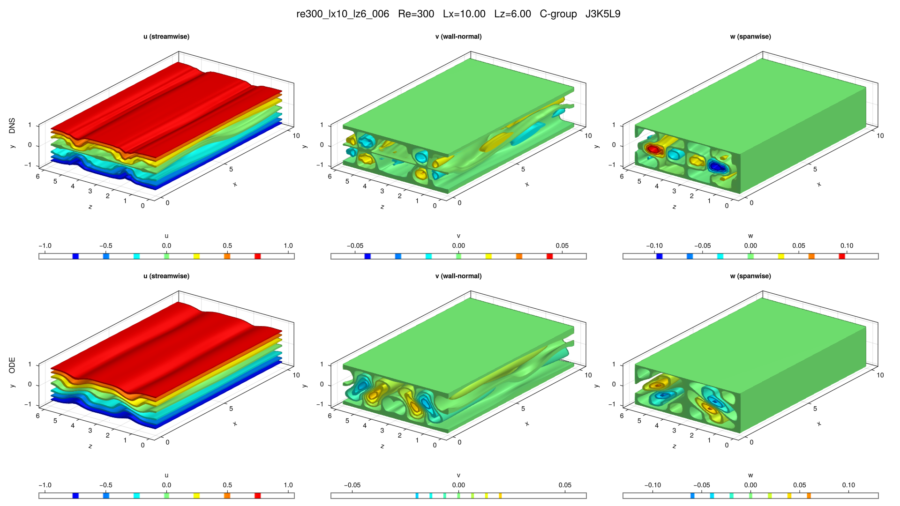

# re300_lx10_lz6_006

## Summary

| Quantity | Value |
|---|---:|
| Case | `re300_lx10_lz6` |
| Catalog source | `eqb_catalog` |
| Re | 300.0 |
| Lx | 10.0 |
| Lz | 6.0 |
| Shear | 0.327932 |
| L2 | 0.132183 |
| Groups | `A, B, C, F, G` |

## Literature

No literature mapping recorded yet.

## Possible Same Branch

No cross-parameter ODE deduplication candidate recorded yet.

## Representative Files

- ODE coefficients: [representative.asc](representative.asc)
- DNS flowfield: [ubest.nc](ubest.nc)

## DNS/ODE Comparison

## DNS Diagnostics

| Quantity | Value |
|---|---:|
| L2 | 0.132183 |
| u2 | 0.182452 |
| v2 | 0.0192245 |
| w2 | 0.035865 |
| e3d | 0.0737906 |
| ecf | 0.00165588 |
| ubulk | 0.0 |
| wbulk | 0.0 |
| wallshear | 0.327932 |
| wallshear_a | 0.163966 |
| wallshear_b | -0.163966 |
| dissipation | 0.327932 |
| I_total | 1.3279320000000001 |
| D_total | 1.3279320000000001 |

## Eigenvalue Analysis

| Quantity | Value |
|---|---:|
| Method | `findeigenvals` |
| Eigenvalues | 32 |
| Unstable count | 4 |
| Leading lambda | 0.03330951226290308 + 0.0i |
| Leading multiplier | 1.181219714896761 + 0.0i |
| Leading residual | 0.03934120918923062 |

- Spectrum: [lambda.asc](eigen/lambda.asc)
- Multipliers: [Lambda.asc](eigen/Lambda.asc)
- Residuals: [Residu.asc](eigen/Residu.asc)
- Leading eigenvector: [ef1.nc](eigen/ef1.nc)

## Group Representatives

| Group | Symmetry | Representative | Members |
|---|---|---|---|
| A | `<sxyz, txz>` | `/home/ebenq/dev/MyCloudAtlas.jl/notebooks/eqb_fuzzing/overnight_runs_updated/re300_lx10_lz6/A/jkl_2_4_7/dns_findsoln/sol001/ubest.nc` | `on:sol001@J2K4L7;ls:sol001@J3K5L9` |
| B | `<sxy, sz>` | `/home/ebenq/dev/MyCloudAtlas.jl/notebooks/eqb_fuzzing/overnight_runs_updated/re300_lx10_lz6/B/jkl_2_4_9/dns_findsoln/sol002/ubest.nc` | `on:sol002@J2K4L9;ls:sol001@J3K5L9;ls:sol002@J2K4L9` |
| C | `<sxytz, sz>` | `/home/ebenq/dev/MyCloudAtlas.jl/notebooks/eqb_fuzzing/overnight_runs_updated/re300_lx10_lz6/C/jkl_3_5_9/dns_findsoln/sol001/ubest.nc` | `on:sol001@J3K5L9;on:sol002@J2K4L9` |
| F | `<sxy, sz, txz>` | `/home/ebenq/dev/MyCloudAtlas.jl/notebooks/eqb_fuzzing/overnight_runs_updated/re300_lx10_lz6/F/jkl_3_5_9/dns_findsoln/sol001/ubest.nc` | `on:sol001@J3K5L9;ls:sol001@J3K5L9` |
| G | `<sxyz>` | `/home/ebenq/dev/MyCloudAtlas.jl/notebooks/eqb_fuzzing/low_shear/re300_lx10_lz6/G/jkl_1_3_5/dns_findsoln/sol004/ubest.nc` | `ls:sol004@J1K3L5` |

## DNS Bifurcation

- CSV: [dns_combined_curve.csv](bifurcations/dns_combined_curve.csv)
- Points: 18
- Re range: 299.98 to 519.01983
- Input range: 1.0977836 to 1.3282504
