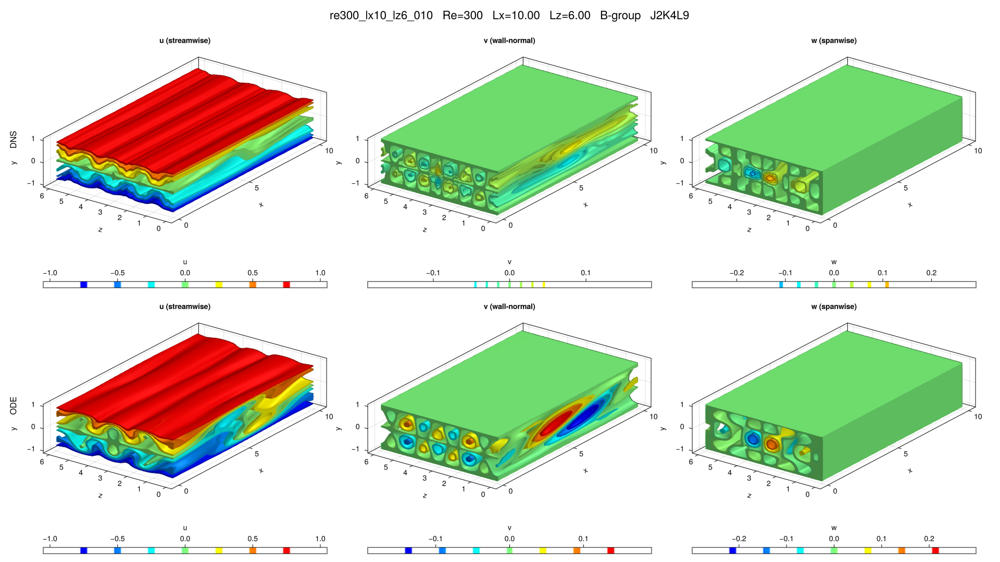

# re300_lx10_lz6_010

## Summary

| Quantity | Value |
|---|---:|
| Case | `re300_lx10_lz6` |
| Catalog source | `eqb_catalog` |
| Re | 300.0 |
| Lx | 10.0 |
| Lz | 6.0 |
| Shear | 0.394206 |
| L2 | 0.13072 |
| Groups | `B` |

## Literature

No literature mapping recorded yet.

## Possible Same Branch

No cross-parameter ODE deduplication candidate recorded yet.

## Representative Files

- ODE coefficients: [representative.asc](representative.asc)
- DNS flowfield: [ubest.nc](ubest.nc)

## DNS/ODE Comparison

## DNS Diagnostics

| Quantity | Value |
|---|---:|
| L2 | 0.269622 |
| u2 | 0.35508 |
| v2 | 0.0821262 |
| w2 | 0.112098 |
| e3d | 0.170479 |
| ecf | 0.0193106 |
| ubulk | 1.01994e-11 |
| wbulk | -3.26966e-14 |
| wallshear | 1.42284 |
| wallshear_a | 0.711422 |
| wallshear_b | -0.711422 |
| dissipation | 1.43199 |
| I_total | 2.42284 |
| D_total | 2.43199 |

## Eigenvalue Analysis

| Quantity | Value |
|---|---:|
| Method | `findeigenvals` |
| Eigenvalues | 32 |
| Unstable count | 9 |
| Leading lambda | 0.06694352834901393 + 0.0i |
| Leading multiplier | 1.3975457209357807 + 0.0i |
| Leading residual | 0.016321835186041612 |

- Spectrum: [lambda.asc](eigen/lambda.asc)
- Multipliers: [Lambda.asc](eigen/Lambda.asc)
- Residuals: [Residu.asc](eigen/Residu.asc)
- Leading eigenvector: [ef1.nc](eigen/ef1.nc)

## Group Representatives

| Group | Symmetry | Representative | Members |
|---|---|---|---|
| B | `<sxy, sz>` | `/home/ebenq/dev/MyCloudAtlas.jl/notebooks/eqb_fuzzing/low_shear/re300_lx10_lz6/B/jkl_2_4_9/dns_findsoln/sol003/ubest.nc` | `ls:sol003@J2K4L9` |

## DNS Bifurcation

- CSV: [dns_combined_curve.csv](bifurcations/dns_combined_curve.csv)
- Points: 64
- Re range: 274.38199 to 324.84911
- Input range: 1.3345615 to 1.6290406
