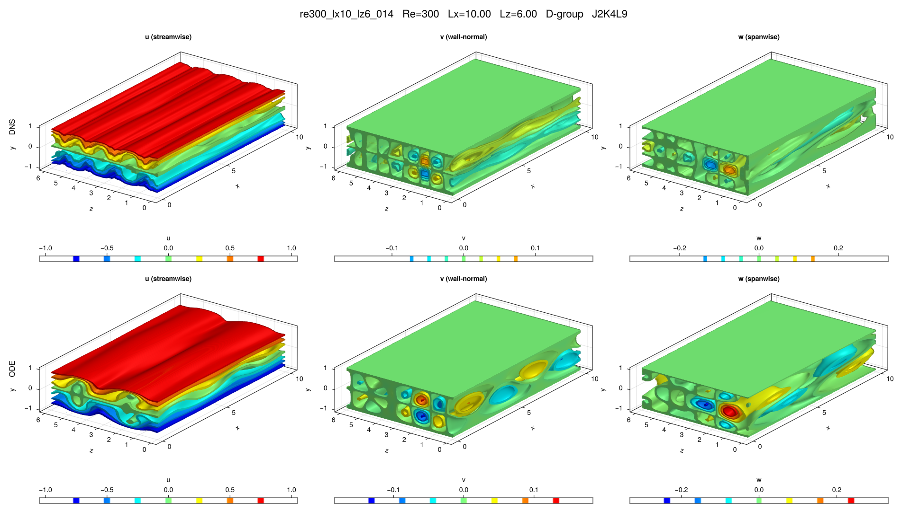

# re300_lx10_lz6_014

## Summary

| Quantity | Value |
|---|---:|
| Case | `re300_lx10_lz6` |
| Catalog source | `eqb_catalog` |
| Re | 300.0 |
| Lx | 10.0 |
| Lz | 6.0 |
| Shear | 0.580333 |
| L2 | 0.155926 |
| Groups | `D` |

## Literature

No literature mapping recorded yet.

## Possible Same Branch

No cross-parameter ODE deduplication candidate recorded yet.

## Representative Files

- ODE coefficients: [representative.asc](representative.asc)
- DNS flowfield: [ubest.nc](ubest.nc)

## DNS/ODE Comparison

## DNS Diagnostics

| Quantity | Value |
|---|---:|
| L2 | 0.155926 |
| u2 | 0.210785 |
| v2 | 0.0321707 |
| w2 | 0.0562189 |
| e3d | 0.0847835 |
| ecf | 0.00419551 |
| ubulk | 0.0 |
| wbulk | 0.0 |
| wallshear | 0.580333 |
| wallshear_a | 0.290167 |
| wallshear_b | -0.290167 |
| dissipation | 0.580333 |
| I_total | 1.580333 |
| D_total | 1.580333 |

## Eigenvalue Analysis

| Quantity | Value |
|---|---:|
| Method | `findeigenvals` |
| Eigenvalues | 32 |
| Unstable count | 8 |
| Leading lambda | 0.07749335331180716 + 0.0i |
| Leading multiplier | 1.473243991838207 + 0.0i |
| Leading residual | 0.02172895553901143 |

- Spectrum: [lambda.asc](eigen/lambda.asc)
- Multipliers: [Lambda.asc](eigen/Lambda.asc)
- Residuals: [Residu.asc](eigen/Residu.asc)
- Leading eigenvector: [ef1.nc](eigen/ef1.nc)

## Group Representatives

| Group | Symmetry | Representative | Members |
|---|---|---|---|
| D | `<sxy, sztx>` | `/home/ebenq/dev/MyCloudAtlas.jl/notebooks/eqb_fuzzing/overnight_runs_updated/re300_lx10_lz6/D/jkl_2_4_9/dns_findsoln/sol002/ubest.nc` | `on:sol002@J2K4L9` |

## DNS Bifurcation

- CSV: [dns_combined_curve.csv](bifurcations/dns_combined_curve.csv)
- Points: 88
- Re range: 185.20738 to 451.87528
- Input range: 1.5656772 to 3.5509005
