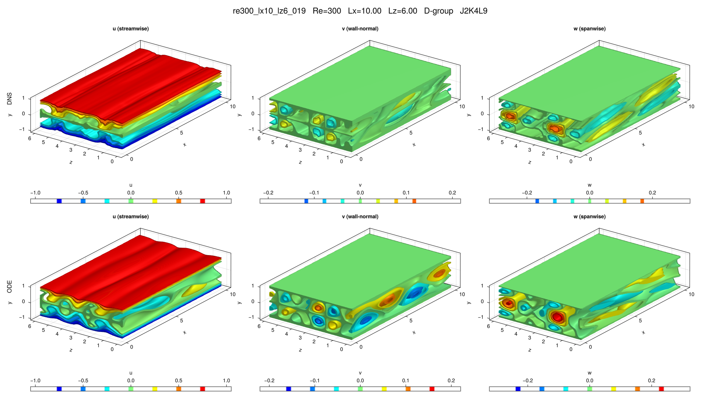

# re300_lx10_lz6_019

## Summary

| Quantity | Value |
|---|---:|
| Case | `re300_lx10_lz6` |
| Catalog source | `eqb_catalog` |
| Re | 300.0 |
| Lx | 10.0 |
| Lz | 6.0 |
| Shear | 0.830666 |
| L2 | 0.22263 |
| Groups | `D` |

## Literature

No literature mapping recorded yet.

## Possible Same Branch

No cross-parameter ODE deduplication candidate recorded yet.

## Representative Files

- ODE coefficients: [representative.asc](representative.asc)
- DNS flowfield: [ubest.nc](ubest.nc)

## DNS/ODE Comparison

## DNS Diagnostics

| Quantity | Value |
|---|---:|
| L2 | 0.197256 |
| u2 | 0.268303 |
| v2 | 0.0423094 |
| w2 | 0.0635874 |
| e3d | 0.104332 |
| ecf | 0.00583344 |
| ubulk | -5.25859e-12 |
| wbulk | 1.35966e-14 |
| wallshear | 0.693353 |
| wallshear_a | 0.346676 |
| wallshear_b | -0.346676 |
| dissipation | 0.693763 |
| I_total | 1.693353 |
| D_total | 1.6937630000000001 |

## Eigenvalue Analysis

| Quantity | Value |
|---|---:|
| Method | `findeigenvals` |
| Eigenvalues | 32 |
| Unstable count | 4 |
| Leading lambda | 0.03918816770533218 + -0.033741380962068794i |
| Leading multiplier | 1.1991845745518905 + -0.2042522149881569i |
| Leading residual | 0.002447528125699508 |

- Spectrum: [lambda.asc](eigen/lambda.asc)
- Multipliers: [Lambda.asc](eigen/Lambda.asc)
- Residuals: [Residu.asc](eigen/Residu.asc)
- Leading eigenvector: [ef1.nc](eigen/ef1.nc)

## Group Representatives

| Group | Symmetry | Representative | Members |
|---|---|---|---|
| D | `<sxy, sztx>` | `/home/ebenq/dev/MyCloudAtlas.jl/notebooks/eqb_fuzzing/low_shear/re300_lx10_lz6/D/jkl_2_4_9/dns_findsoln/sol001/ubest.nc` | `ls:sol001@J2K4L9;ls:sol002@J2K4L7` |

## DNS Bifurcation

- CSV: [dns_combined_curve.csv](bifurcations/dns_combined_curve.csv)
- Points: 86
- Re range: 244.99491 to 449.221
- Input range: 1.8286991 to 2.6748174
