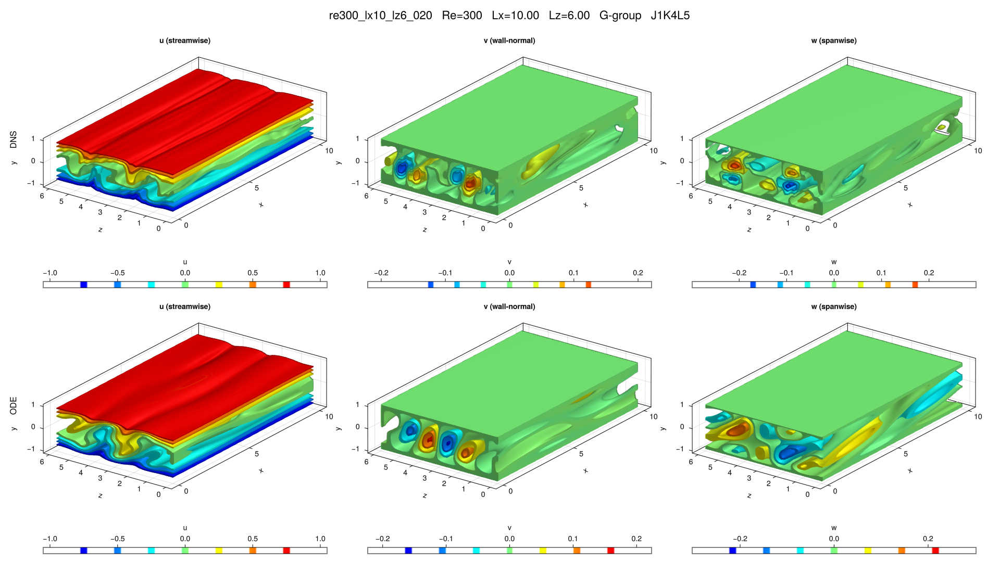

# re300_lx10_lz6_020

## Summary

| Quantity | Value |
|---|---:|
| Case | `re300_lx10_lz6` |
| Catalog source | `eqb_catalog` |
| Re | 300.0 |
| Lx | 10.0 |
| Lz | 6.0 |
| Shear | 0.871758 |
| L2 | 0.231991 |
| Groups | `G` |

## Literature

No literature mapping recorded yet.

## Possible Same Branch

No cross-parameter ODE deduplication candidate recorded yet.

## Representative Files

- ODE coefficients: [representative.asc](representative.asc)
- DNS flowfield: [ubest.nc](ubest.nc)

## DNS/ODE Comparison

## DNS Diagnostics

| Quantity | Value |
|---|---:|
| L2 | 0.231991 |
| u2 | 0.316486 |
| v2 | 0.0509217 |
| w2 | 0.0698805 |
| e3d | 0.109413 |
| ecf | 0.0074763 |
| ubulk | 0.0 |
| wbulk | 0.0 |
| wallshear | 0.871758 |
| wallshear_a | 0.435879 |
| wallshear_b | -0.435879 |
| dissipation | 0.871755 |
| I_total | 1.871758 |
| D_total | 1.8717549999999998 |

## Eigenvalue Analysis

| Quantity | Value |
|---|---:|
| Method | `findeigenvals` |
| Eigenvalues | 32 |
| Unstable count | 9 |
| Leading lambda | 0.10809922875315503 + 0.1132806404484062i |
| Leading multiplier | 1.4487477862882945 + 0.9212669655368412i |
| Leading residual | 0.0027309437417198114 |

- Spectrum: [lambda.asc](eigen/lambda.asc)
- Multipliers: [Lambda.asc](eigen/Lambda.asc)
- Residuals: [Residu.asc](eigen/Residu.asc)
- Leading eigenvector: [ef1.nc](eigen/ef1.nc)

## Group Representatives

| Group | Symmetry | Representative | Members |
|---|---|---|---|
| G | `<sxyz>` | `/home/ebenq/dev/MyCloudAtlas.jl/notebooks/eqb_fuzzing/overnight_runs_updated/re300_lx10_lz6/G/jkl_1_4_5/dns_findsoln/sol003/ubest.nc` | `on:sol003@J1K4L5` |

## DNS Bifurcation

- CSV: [dns_combined_curve.csv](bifurcations/dns_combined_curve.csv)
- Points: 65
- Re range: 295.81315 to 326.88285
- Input range: 1.7931316 to 2.0597931
