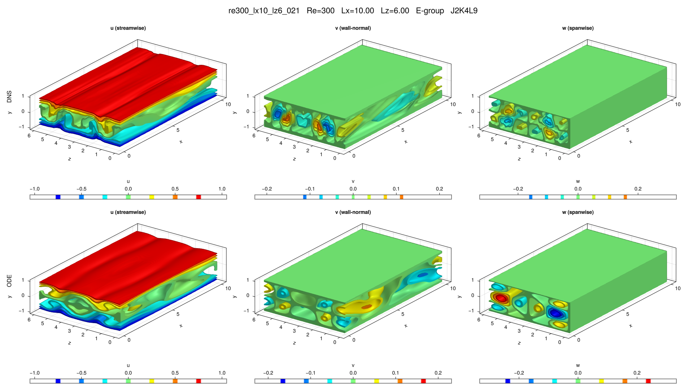

# re300_lx10_lz6_021

## Summary

| Quantity | Value |
|---|---:|
| Case | `re300_lx10_lz6` |
| Catalog source | `eqb_catalog` |
| Re | 300.0 |
| Lx | 10.0 |
| Lz | 6.0 |
| Shear | 0.978733 |
| L2 | 0.24704 |
| Groups | `C, E` |

## Literature

No literature mapping recorded yet.

## Possible Same Branch

No cross-parameter ODE deduplication candidate recorded yet.

## Representative Files

- ODE coefficients: [representative.asc](representative.asc)
- DNS flowfield: [ubest.nc](ubest.nc)

## DNS/ODE Comparison

## DNS Diagnostics

| Quantity | Value |
|---|---:|
| L2 | 0.24704 |
| u2 | 0.338274 |
| v2 | 0.0542315 |
| w2 | 0.0684588 |
| e3d | 0.11536 |
| ecf | 0.00762766 |
| ubulk | 0.0 |
| wbulk | 0.0 |
| wallshear | 0.978733 |
| wallshear_a | 0.489366 |
| wallshear_b | -0.489366 |
| dissipation | 0.978733 |
| I_total | 1.978733 |
| D_total | 1.978733 |

## Eigenvalue Analysis

| Quantity | Value |
|---|---:|
| Method | `findeigenvals` |
| Eigenvalues | 32 |
| Unstable count | 9 |
| Leading lambda | 0.04583146156079093 + 0.0i |
| Leading multiplier | 1.2575398442825643 + 0.0i |
| Leading residual | 0.16714677364000927 |

- Spectrum: [lambda.asc](eigen/lambda.asc)
- Multipliers: [Lambda.asc](eigen/Lambda.asc)
- Residuals: [Residu.asc](eigen/Residu.asc)
- Leading eigenvector: [ef1.nc](eigen/ef1.nc)

## Group Representatives

| Group | Symmetry | Representative | Members |
|---|---|---|---|
| C | `<sxytz, sz>` | `/home/ebenq/dev/MyCloudAtlas.jl/notebooks/eqb_fuzzing/low_shear/re300_lx10_lz6/C/jkl_2_4_9/dns_findsoln/sol002/ubest.nc` | `ls:sol002@J2K4L9` |
| E | `<sxyz, sztxz>` | `/home/ebenq/dev/MyCloudAtlas.jl/notebooks/eqb_fuzzing/overnight_runs_updated/re300_lx10_lz6/E/jkl_2_4_9/dns_findsoln/sol003/ubest.nc` | `on:sol003@J2K4L9` |

## DNS Bifurcation

- CSV: [dns_combined_curve.csv](bifurcations/dns_combined_curve.csv)
- Points: 87
- Re range: 270.16916 to 999.8719
- Input range: 1.0625668 to 3.0998563
