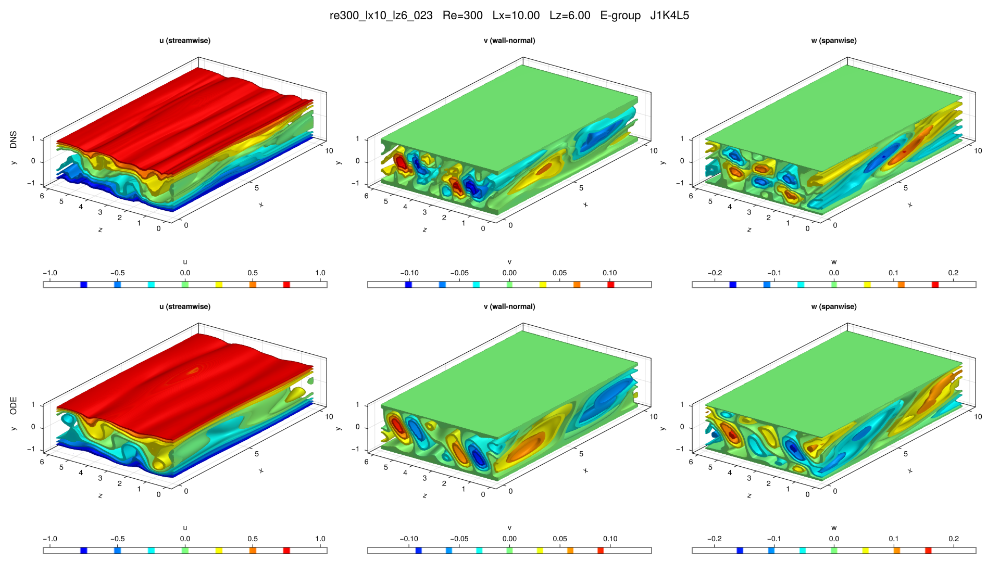

# re300_lx10_lz6_023

## Summary

| Quantity | Value |
|---|---:|
| Case | `re300_lx10_lz6` |
| Catalog source | `eqb_catalog` |
| Re | 300.0 |
| Lx | 10.0 |
| Lz | 6.0 |
| Shear | 1.10725 |
| L2 | 0.261748 |
| Groups | `E` |

## Literature

No literature mapping recorded yet.

## Possible Same Branch

No cross-parameter ODE deduplication candidate recorded yet.

## Representative Files

- ODE coefficients: [representative.asc](representative.asc)
- DNS flowfield: [ubest.nc](ubest.nc)

## DNS/ODE Comparison

## DNS Diagnostics

| Quantity | Value |
|---|---:|
| L2 | 0.183429 |
| u2 | 0.254524 |
| v2 | 0.0224525 |
| w2 | 0.0447822 |
| e3d | 0.0585834 |
| ecf | 0.00250956 |
| ubulk | 2.12769e-11 |
| wbulk | 1.52587e-13 |
| wallshear | 0.48441 |
| wallshear_a | 0.242205 |
| wallshear_b | -0.242205 |
| dissipation | 0.482333 |
| I_total | 1.48441 |
| D_total | 1.4823330000000001 |

## Eigenvalue Analysis

| Quantity | Value |
|---|---:|
| Method | `findeigenvals` |
| Eigenvalues | 32 |
| Unstable count | 9 |
| Leading lambda | 0.060294041308159754 + 0.0i |
| Leading multiplier | 1.351844838404078 + 0.0i |
| Leading residual | 0.1497987953293344 |

- Spectrum: [lambda.asc](eigen/lambda.asc)
- Multipliers: [Lambda.asc](eigen/Lambda.asc)
- Residuals: [Residu.asc](eigen/Residu.asc)
- Leading eigenvector: [ef1.nc](eigen/ef1.nc)

## Group Representatives

| Group | Symmetry | Representative | Members |
|---|---|---|---|
| E | `<sxyz, sztxz>` | `/home/ebenq/dev/MyCloudAtlas.jl/notebooks/eqb_fuzzing/low_shear/re300_lx10_lz6/E/jkl_1_4_5/dns_findsoln/sol005/ubest.nc` | `ls:sol005@J1K4L5` |

## DNS Bifurcation

- CSV: [dns_combined_curve.csv](bifurcations/dns_combined_curve.csv)
- Points: 83
- Re range: 278.00869 to 504.11261
- Input range: 1.6616838 to 3.1983725
