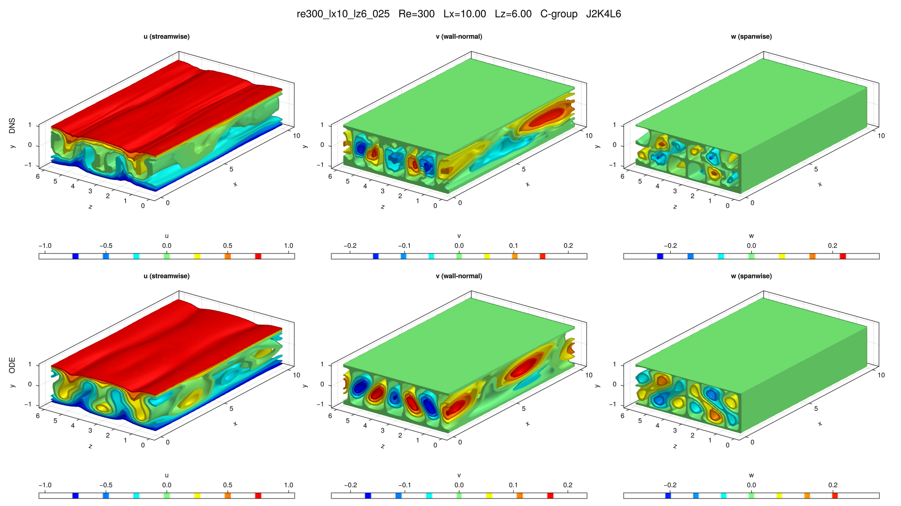

# re300_lx10_lz6_025

## Summary

| Quantity | Value |
|---|---:|
| Case | `re300_lx10_lz6` |
| Catalog source | `eqb_catalog` |
| Re | 300.0 |
| Lx | 10.0 |
| Lz | 6.0 |
| Shear | 1.50822 |
| L2 | 0.307106 |
| Groups | `C` |

## Literature

No literature mapping recorded yet.

## Possible Same Branch

No cross-parameter ODE deduplication candidate recorded yet.

## Representative Files

- ODE coefficients: [representative.asc](representative.asc)
- DNS flowfield: [ubest.nc](ubest.nc)

## DNS/ODE Comparison

## DNS Diagnostics

| Quantity | Value |
|---|---:|
| L2 | 0.307106 |
| u2 | 0.412197 |
| v2 | 0.0797945 |
| w2 | 0.11115 |
| e3d | 0.140537 |
| ecf | 0.0187216 |
| ubulk | 0.0 |
| wbulk | 0.0 |
| wallshear | 1.50822 |
| wallshear_a | 0.75411 |
| wallshear_b | -0.75411 |
| dissipation | 1.50822 |
| I_total | 2.5082199999999997 |
| D_total | 2.5082199999999997 |

## Eigenvalue Analysis

| Quantity | Value |
|---|---:|
| Method | `findeigenvals` |
| Eigenvalues | 32 |
| Unstable count | 15 |
| Leading lambda | 0.08516435280906427 + -0.13328559749319438i |
| Leading multiplier | 1.2032997684075708 + -0.9463429379672315i |
| Leading residual | 0.08870465777508844 |

- Spectrum: [lambda.asc](eigen/lambda.asc)
- Multipliers: [Lambda.asc](eigen/Lambda.asc)
- Residuals: [Residu.asc](eigen/Residu.asc)
- Leading eigenvector: [ef1.nc](eigen/ef1.nc)

## Group Representatives

| Group | Symmetry | Representative | Members |
|---|---|---|---|
| C | `<sxytz, sz>` | `/home/ebenq/dev/MyCloudAtlas.jl/notebooks/eqb_fuzzing/overnight_runs_updated/re300_lx10_lz6/C/jkl_2_4_6/dns_findsoln/sol003/ubest.nc` | `on:sol003@J2K4L6` |

## DNS Bifurcation

- CSV: [dns_combined_curve.csv](bifurcations/dns_combined_curve.csv)
- Points: 32
- Re range: 292.0388 to 500.15458
- Input range: 2.496375 to 3.134991
