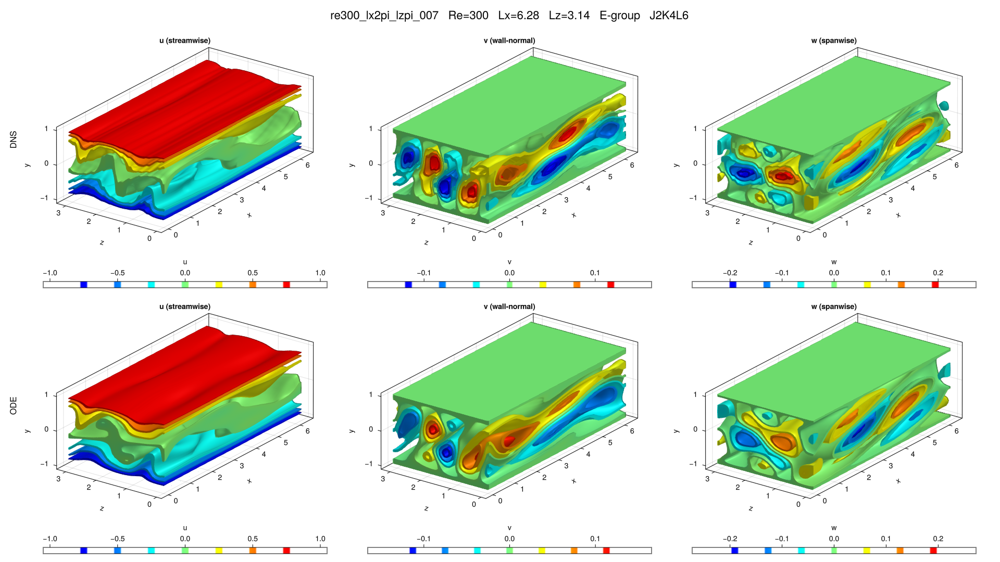

# re300_lx2pi_lzpi_007

## Summary

| Quantity | Value |
|---|---:|
| Case | `re300_lx2pi_lzpi` |
| Catalog source | `eqb_catalog` |
| Re | 300.0 |
| Lx | 6.283185307179586 |
| Lz | 3.141592653589793 |
| Shear | 1.10084 |
| L2 | 0.246689 |
| Groups | `E` |

## Literature

No literature mapping recorded yet.

## Possible Same Branch

No cross-parameter ODE deduplication candidate recorded yet.

## Representative Files

- ODE coefficients: [representative.asc](representative.asc)
- DNS flowfield: [ubest.nc](ubest.nc)

## DNS/ODE Comparison

## DNS Diagnostics

| Quantity | Value |
|---|---:|
| L2 | 0.246689 |
| u2 | 0.325865 |
| v2 | 0.0676912 |
| w2 | 0.104599 |
| e3d | 0.118645 |
| ecf | 0.0155231 |
| ubulk | 0.0 |
| wbulk | 0.0 |
| wallshear | 1.10084 |
| wallshear_a | 0.55042 |
| wallshear_b | -0.55042 |
| dissipation | 1.10084 |
| I_total | 2.10084 |
| D_total | 2.10084 |

## Eigenvalue Analysis

| Quantity | Value |
|---|---:|
| Method | `findeigenvals` |
| Eigenvalues | 32 |
| Unstable count | 11 |
| Leading lambda | 0.06630612149113467 + -0.037649319501320444i |
| Leading multiplier | 1.3684881220738927 + -0.2606999885917179i |
| Leading residual | 0.00041805809700115615 |

- Spectrum: [lambda.asc](eigen/lambda.asc)
- Multipliers: [Lambda.asc](eigen/Lambda.asc)
- Residuals: [Residu.asc](eigen/Residu.asc)
- Leading eigenvector: [ef1.nc](eigen/ef1.nc)

## Group Representatives

| Group | Symmetry | Representative | Members |
|---|---|---|---|
| E | `<sxyz, sztxz>` | `/home/ebenq/dev/MyCloudAtlas.jl/notebooks/eqb_fuzzing/overnight_runs_updated/re300_lx2pi_lzpi/E/jkl_2_4_5/dns_findsoln/sol003/ubest.nc` | `on:sol003@J2K4L5;on:sol004@J2K4L5;on:sol005@J1K4L5;ls:sol003@J2K4L6;ls:sol004@J2K4L5;ls:sol005@J2K4L5;ls:sol007@J1K4L5` |

## DNS Bifurcation

- CSV: [dns_combined_curve.csv](bifurcations/dns_combined_curve.csv)
- Points: 84
- Re range: 194.87437 to 340.84589
- Input range: 1.3853799 to 2.8156666
