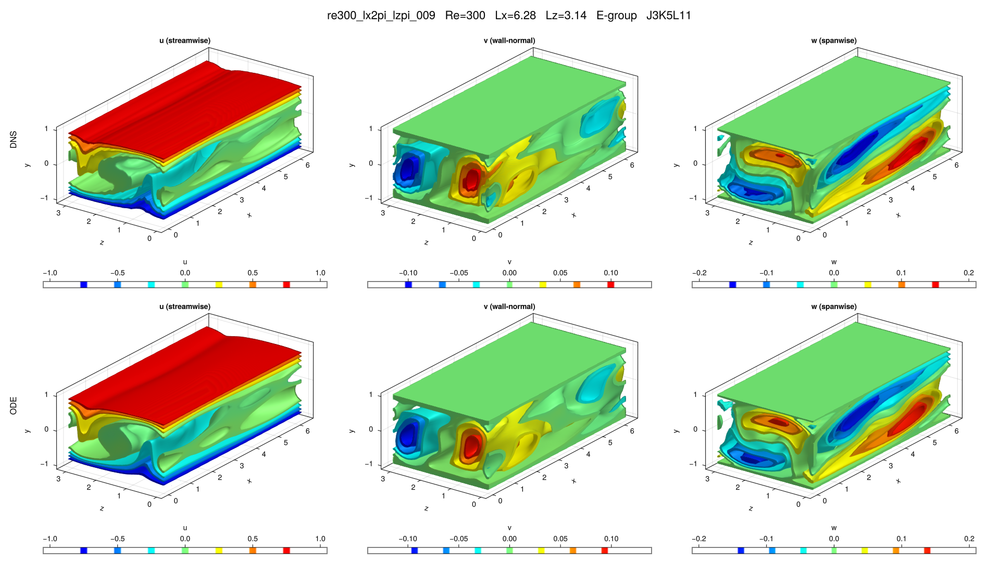

# re300_lx2pi_lzpi_009

## Summary

| Quantity | Value |
|---|---:|
| Case | `re300_lx2pi_lzpi` |
| Catalog source | `eqb_catalog` |
| Re | 300.0 |
| Lx | 6.283185307179586 |
| Lz | 3.141592653589793 |
| Shear | 1.80947 |
| L2 | 0.382856 |
| Groups | `E` |

## Literature

No literature mapping recorded yet.

## Possible Same Branch

No cross-parameter ODE deduplication candidate recorded yet.

## Representative Files

- ODE coefficients: [representative.asc](representative.asc)
- DNS flowfield: [ubest.nc](ubest.nc)

## DNS/ODE Comparison

## DNS Diagnostics

| Quantity | Value |
|---|---:|
| L2 | 0.382856 |
| u2 | 0.526096 |
| v2 | 0.0698043 |
| w2 | 0.107275 |
| e3d | 0.0991149 |
| ecf | 0.0163806 |
| ubulk | 0.0 |
| wbulk | 0.0 |
| wallshear | 1.80947 |
| wallshear_a | 0.904734 |
| wallshear_b | -0.904734 |
| dissipation | 1.80947 |
| I_total | 2.80947 |
| D_total | 2.80947 |

## Eigenvalue Analysis

| Quantity | Value |
|---|---:|
| Method | `findeigenvals` |
| Eigenvalues | 32 |
| Unstable count | 5 |
| Leading lambda | 0.024687202476486515 + -0.09225524721587124i |
| Leading multiplier | 1.0131318870644943 + -0.5035663525804287i |
| Leading residual | 0.0021367243405609965 |

- Spectrum: [lambda.asc](eigen/lambda.asc)
- Multipliers: [Lambda.asc](eigen/Lambda.asc)
- Residuals: [Residu.asc](eigen/Residu.asc)
- Leading eigenvector: [ef1.nc](eigen/ef1.nc)

## Group Representatives

| Group | Symmetry | Representative | Members |
|---|---|---|---|
| E | `<sxyz, sztxz>` | `/home/ebenq/dev/MyCloudAtlas.jl/notebooks/eqb_fuzzing/overnight_runs_updated/re300_lx2pi_lzpi/E/jkl_3_5_11/dns_findsoln/sol001/ubest.nc` | `on:sol001@J3K5L11;on:sol006@J1K4L5;on:sol008@J1K3L5;ls:sol001@J3K5L11;ls:sol006@J1K4L5` |

## DNS Bifurcation

- CSV: [dns_combined_curve.csv](bifurcations/dns_combined_curve.csv)
- Points: 62
- Re range: 163.50443 to 501.2222
- Input range: 1.4181961 to 3.1966819
