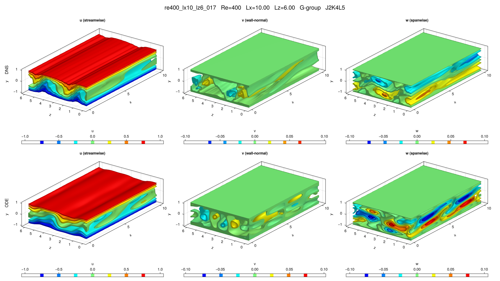

# re400_lx10_lz6_017

## Summary

| Quantity | Value |
|---|---:|
| Case | `re400_lx10_lz6` |
| Catalog source | `eqb_catalog` |
| Re | 400.0 |
| Lx | 10.0 |
| Lz | 6.0 |
| Shear | 0.814528 |
| L2 | 0.280465 |
| Groups | `G` |

## Literature

No literature mapping recorded yet.

## Possible Same Branch

No cross-parameter ODE deduplication candidate recorded yet.

## Representative Files

- ODE coefficients: [representative.asc](representative.asc)
- DNS flowfield: [ubest.nc](ubest.nc)

## DNS/ODE Comparison

## DNS Diagnostics

| Quantity | Value |
|---|---:|
| L2 | 0.500747 |
| u2 | 0.706661 |
| v2 | 0.0246295 |
| w2 | 0.0389639 |
| e3d | 0.0595315 |
| ecf | 0.00212479 |
| ubulk | 0.0 |
| wbulk | 0.0 |
| wallshear | 1.81401 |
| wallshear_a | 0.907004 |
| wallshear_b | -0.907004 |
| dissipation | 1.81358 |
| I_total | 2.8140099999999997 |
| D_total | 2.81358 |

## Eigenvalue Analysis

| Quantity | Value |
|---|---:|
| Method | `findeigenvals` |
| Eigenvalues | 32 |
| Unstable count | 9 |
| Leading lambda | 0.05754123485997919 + 0.0014681214712257292i |
| Leading multiplier | 1.3333295458026746 + 0.00978762447316465i |
| Leading residual | 0.09643058225064582 |

- Spectrum: [lambda.asc](eigen/lambda.asc)
- Multipliers: [Lambda.asc](eigen/Lambda.asc)
- Residuals: [Residu.asc](eigen/Residu.asc)
- Leading eigenvector: [ef1.nc](eigen/ef1.nc)

## Group Representatives

| Group | Symmetry | Representative | Members |
|---|---|---|---|
| G | `<sxyz>` | `/home/ebenq/dev/MyCloudAtlas.jl/notebooks/eqb_fuzzing/low_shear/re400_lx10_lz6/G/jkl_2_4_5/dns_findsoln/sol009/ubest.nc` | `ls:sol009@J2K4L5` |

## DNS Bifurcation

No DNS bidirectional bifurcation curve is available for this solution.
