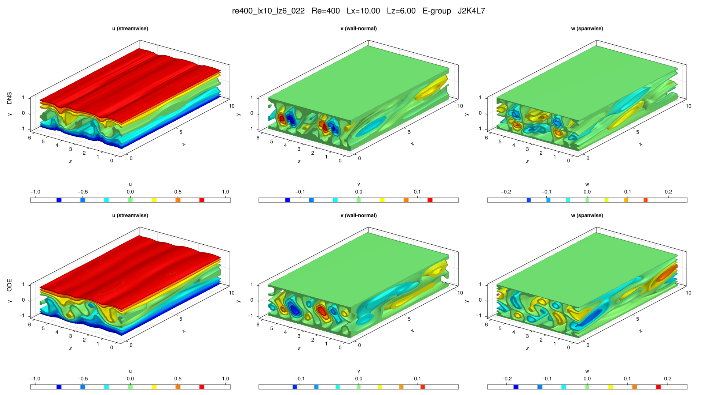

# re400_lx10_lz6_022

## Summary

| Quantity | Value |
|---|---:|
| Case | `re400_lx10_lz6` |
| Catalog source | `eqb_catalog` |
| Re | 400.0 |
| Lx | 10.0 |
| Lz | 6.0 |
| Shear | 1.02892 |
| L2 | 0.25144 |
| Groups | `E` |

## Literature

No literature mapping recorded yet.

## Possible Same Branch

No cross-parameter ODE deduplication candidate recorded yet.

## Representative Files

- ODE coefficients: [representative.asc](representative.asc)
- DNS flowfield: [ubest.nc](ubest.nc)

## DNS/ODE Comparison

## DNS Diagnostics

| Quantity | Value |
|---|---:|
| L2 | 0.166613 |
| u2 | 0.229553 |
| v2 | 0.0286513 |
| w2 | 0.0447721 |
| e3d | 0.0699414 |
| ecf | 0.00282544 |
| ubulk | 4.91291e-12 |
| wbulk | 6.49678e-14 |
| wallshear | 0.597604 |
| wallshear_a | 0.298802 |
| wallshear_b | -0.298802 |
| dissipation | 0.599559 |
| I_total | 1.597604 |
| D_total | 1.599559 |

## Eigenvalue Analysis

| Quantity | Value |
|---|---:|
| Method | `findeigenvals` |
| Eigenvalues | 32 |
| Unstable count | 10 |
| Leading lambda | 0.10982630918051438 + -0.0425060268290428i |
| Leading multiplier | 1.692784692988679 + -0.36528423929963244i |
| Leading residual | 0.020007848132818484 |

- Spectrum: [lambda.asc](eigen/lambda.asc)
- Multipliers: [Lambda.asc](eigen/Lambda.asc)
- Residuals: [Residu.asc](eigen/Residu.asc)
- Leading eigenvector: [ef1.nc](eigen/ef1.nc)

## Group Representatives

| Group | Symmetry | Representative | Members |
|---|---|---|---|
| E | `<sxyz, sztxz>` | `/home/ebenq/dev/MyCloudAtlas.jl/notebooks/eqb_fuzzing/low_shear/re400_lx10_lz6/E/jkl_2_4_7/dns_findsoln/sol007/ubest.nc` | `ls:sol007@J2K4L7` |

## DNS Bifurcation

No DNS bidirectional bifurcation curve is available for this solution.
