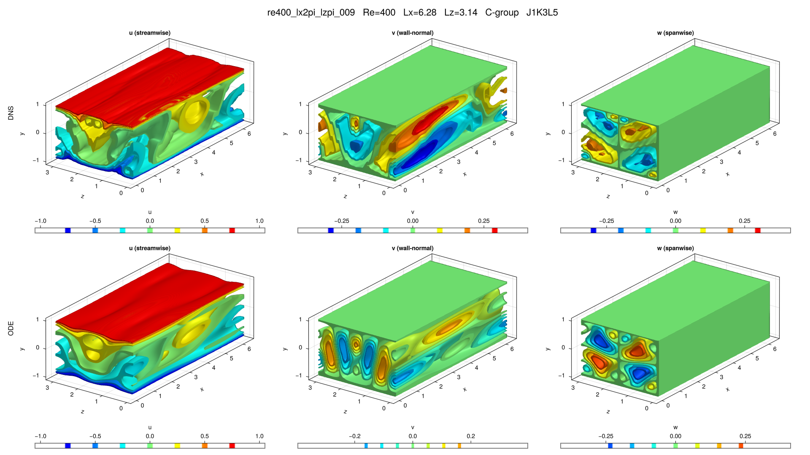

# re400_lx2pi_lzpi_009

## Summary

| Quantity | Value |
|---|---:|
| Case | `re400_lx2pi_lzpi` |
| Catalog source | `eqb_catalog` |
| Re | 400.0 |
| Lx | 6.283185307179586 |
| Lz | 3.141592653589793 |
| Shear | 4.39284 |
| L2 | 0.43619 |
| Groups | `C, F` |

## Literature

No literature mapping recorded yet.

## Possible Same Branch

No cross-parameter ODE deduplication candidate recorded yet.

## Representative Files

- ODE coefficients: [representative.asc](representative.asc)
- DNS flowfield: [ubest.nc](ubest.nc)

## DNS/ODE Comparison

## DNS Diagnostics

| Quantity | Value |
|---|---:|
| L2 | 0.43619 |
| u2 | 0.568287 |
| v2 | 0.15176 |
| w2 | 0.185857 |
| e3d | 0.202616 |
| ecf | 0.0575739 |
| ubulk | 0.0 |
| wbulk | 0.0 |
| wallshear | 4.39284 |
| wallshear_a | 2.19642 |
| wallshear_b | -2.19642 |
| dissipation | 4.39284 |
| I_total | 5.39284 |
| D_total | 5.39284 |

## Eigenvalue Analysis

| Quantity | Value |
|---|---:|
| Method | `findeigenvals` |
| Eigenvalues | 32 |
| Unstable count | 21 |
| Leading lambda | 0.1748646450222589 + 0.0i |
| Leading multiplier | 2.397252344654621 + 0.0i |
| Leading residual | 4.3507089267954504e-07 |

- Spectrum: [lambda.asc](eigen/lambda.asc)
- Multipliers: [Lambda.asc](eigen/Lambda.asc)
- Residuals: [Residu.asc](eigen/Residu.asc)
- Leading eigenvector: [ef1.nc](eigen/ef1.nc)

## Group Representatives

| Group | Symmetry | Representative | Members |
|---|---|---|---|
| C | `<sxytz, sz>` | `/home/ebenq/dev/MyCloudAtlas.jl/notebooks/eqb_fuzzing/overnight_runs_updated/re400_lx2pi_lzpi/C/jkl_1_3_5/dns_findsoln/sol005/ubest.nc` | `on:sol005@J1K3L5` |
| F | `<sxy, sz, txz>` | `/home/ebenq/dev/MyCloudAtlas.jl/notebooks/eqb_fuzzing/overnight_runs_updated/re400_lx2pi_lzpi/F/jkl_1_3_5/dns_findsoln/sol003/ubest.nc` | `on:sol003@J1K3L5` |

## DNS Bifurcation

No DNS bidirectional bifurcation curve is available for this solution.
